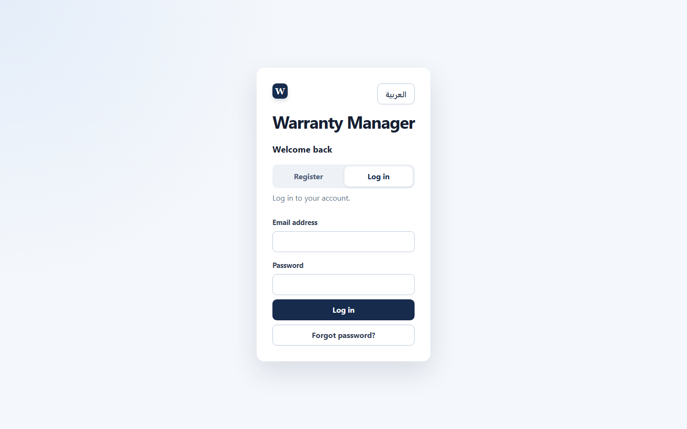
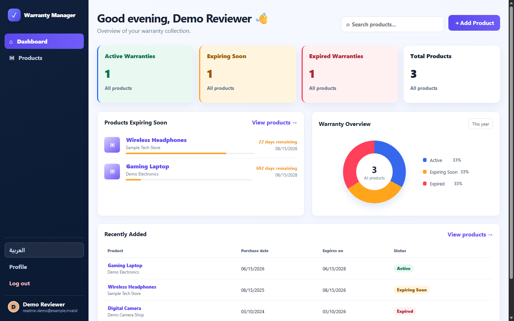
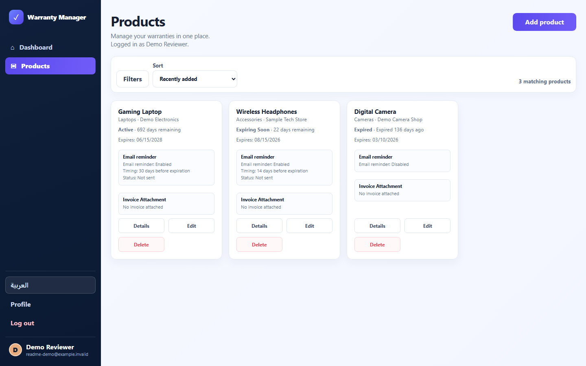
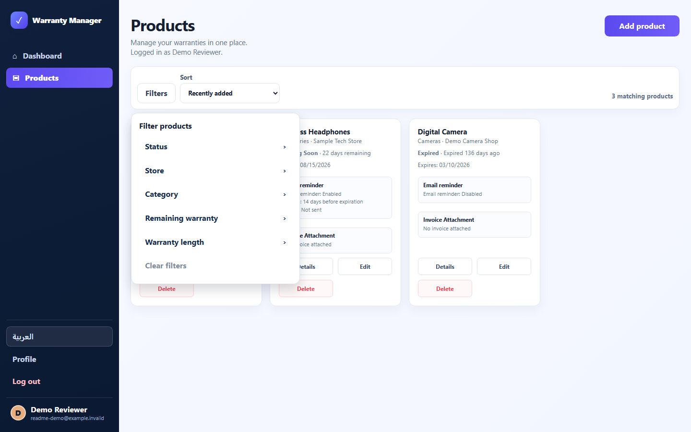
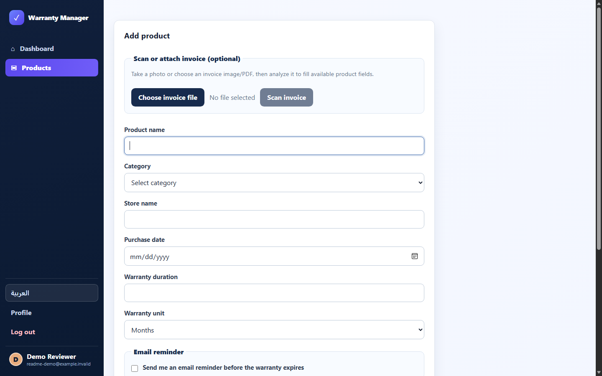
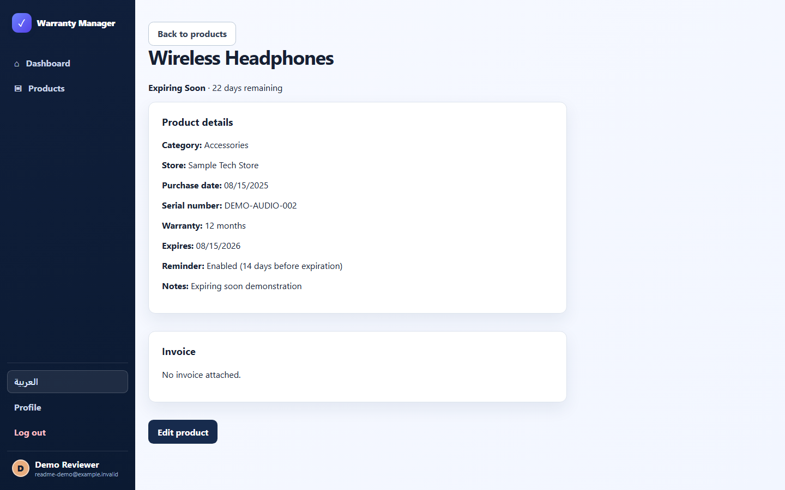
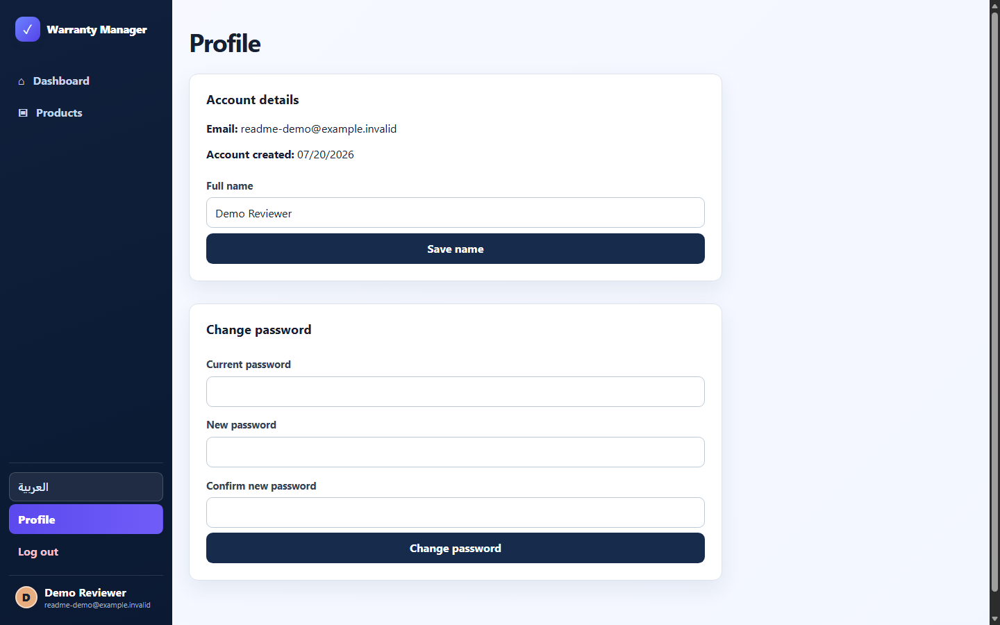
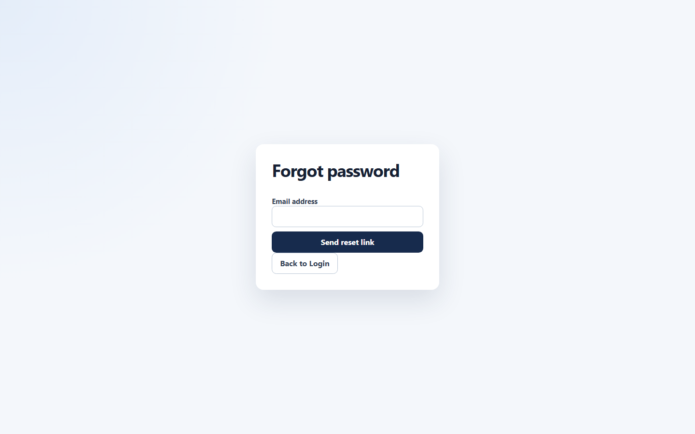
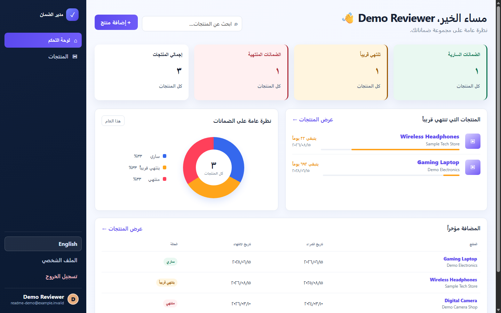

# Warranty Manager

**Developed by:** Saleh Khalid Jarwan

Warranty Manager is a bilingual, responsive web application for storing product warranty records and private invoice attachments. It calculates expiration dates, shows warranty status and remaining time, helps users find their products, and can email a one-time reminder before a warranty expires.

The repository contains a React/Vite frontend, an Express API, a MySQL-compatible schema and additive migration, automated tests, guarded database and file-backup tools, and a same-origin Railway deployment configuration.

## What problem it solves

Paper invoices are easy to lose and warranty dates are difficult to track across products and stores. Warranty Manager keeps each user's product details, proof of purchase, expiration status, and reminder preference together while enforcing owner-only access on the backend.

## Implemented features

- Registration, login, logout, session restoration, profile-name editing, and authenticated password changes.
- Forgot-password and single-use password-reset flows with 30-minute hashed tokens and email delivery.
- Owner-scoped product creation, viewing, editing, and deletion.
- A dedicated product-details page at `/products/:id`.
- Warranty calculations for days, months, and years, including **Active**, **Expiring Soon**, and **Expired** states.
- Dashboard totals, recent products, nearest expirations, product links, and name/store/serial search.
- Product filtering by status, store, category, remaining-time preset, and warranty length; sorting and pagination are also implemented.
- Private invoice upload, replacement, removal, inline viewing, and download.
- AI-assisted invoice extraction with a local text/OCR fallback for supported images and PDFs.
- Per-product email reminders with delivery state, a manual job, and an optional daily in-process scheduler.
- English and Arabic translations, persisted language selection, localized dates/numbers, and LTR/RTL document direction.
- Responsive layouts and accessibility-oriented labels, live regions, visible focus styles, keyboard-dismissable menus, and focus-managed dialogs.

## Screenshots

The screenshots below were captured from the current application at a consistent 1440 × 900 desktop viewport. They use fictional demo account and product data; no real customer, invoice, credential, or reset-token information is shown.

### Authentication



### Dashboard overview



### Product management





### Add product and invoice controls



### Product details



### Profile and password reset





### Arabic RTL interface



No live deployment URL is currently documented or verified.

## Technology stack

| Area | Technologies |
| --- | --- |
| Frontend | React, JavaScript, HTML, CSS, Vite, i18next, react-i18next |
| Backend | Node.js 22, Express |
| Database | MySQL 8-compatible SQL through `mysql2`; compatibility tests also cover the configured TiDB Cloud connection profile |
| Authentication | `express-session`, bcrypt, a custom MySQL production session store |
| Security | Helmet, CORS, exact-origin checks, rate limiting, backend validation |
| Files and extraction | Multer, Tesseract.js, `pdf-parse`, `pdf-to-img`, `heic-convert` |
| Optional AI | Google Gemini through `@google/genai` |
| Email | Nodemailer SMTP or an HTTPS email-provider adapter |
| Testing | Jest, Supertest, React Testing Library, jsdom |
| Delivery | GitHub Actions, Railway/Railpack, Docker Compose for an isolated local staging database |

## Architecture

In development, Vite serves the frontend on port 5173 and proxies `/api` to Express on port 3000. In production, the root build creates `frontend/dist`, and the Express process serves both the compiled frontend and `/api` from one origin.

```text
Browser
  |
  +-- React UI
  |     +-- authentication and profile
  |     +-- dashboard, search, products, filters, details
  |     +-- invoice scan/upload and reminder settings
  |
  +-- /api -> Express
              +-- exact-origin and session middleware
              +-- authenticated, owner-scoped routes
              +-- MySQL/TiDB-compatible data and production sessions
              +-- private persistent invoice directory
              +-- Gemini -> PDF text/Tesseract fallback
              +-- SMTP or HTTPS email provider
```

The backend does not trust a frontend-supplied user ID. Product and invoice queries derive ownership from `req.session.user.id`.

## Repository structure

```text
.
|-- .github/workflows/ci.yml       # CI tests, build, audits, and secret checks
|-- backend/
|   |-- src/
|   |   |-- config/                # Environment, origins, and database pool
|   |   |-- middleware/            # Authentication and request-origin checks
|   |   |-- routes/                # Registered API route groups
|   |   `-- services/              # Warranty, invoice, email, reminder, session services
|   `-- tests/                      # Backend, security, integration, and deployment tests
|-- database/
|   |-- schema.sql                 # Target-neutral baseline schema
|   `-- config.js                  # Compatibility bridge to backend database config
|-- docs/                          # QA/TDD and staging records plus screenshots
|-- frontend/
|   `-- src/                       # React pages, localization, CSS, and UI tests
|-- .env.example                   # Safe development/production variable template
|-- .env.staging.example           # Safe isolated-staging template
|-- DEPLOYMENT.md                  # Detailed operations and deployment guide
|-- PRD.md                         # Product requirements
|-- SECURITY_REVIEW.md             # Security findings and remediation record
|-- docker-compose.staging.yml     # Local isolated MySQL 8.4 service
|-- package.json                   # Railway/root build, start, and test entry points
`-- railway.json                   # Railpack build and health-check configuration
```

## Prerequisites

- Node.js `>=22 <23`
- npm with lockfile-based installs
- A MySQL 8-compatible database
- PowerShell examples below use `npm.cmd`; use `npm` on Linux or macOS
- Optional: Docker Compose for the isolated local staging database
- Optional: SMTP or an HTTPS email API for password-reset delivery and reminders
- Optional: a Gemini API key for AI invoice extraction

## Local installation

From the repository root:

```powershell
Copy-Item .env.example .env

cd backend
npm.cmd ci

cd ..\frontend
npm.cmd ci
```

Set a local `SESSION_SECRET` and database connection values in `.env`. The real `.env` is ignored by Git and must never be committed.

### Database setup

The baseline [database/schema.sql](database/schema.sql) creates five target-neutral tables:

- `users`
- `products`
- `password_reset_tokens`
- `sessions`
- `schema_migrations`

It does not create or select a database. Import it only into a new, empty database:

```powershell
mysql -u <user> -p <database-name> < database\schema.sql
```

For an existing database, back it up first and use the additive migration workflow from `backend/`:

```powershell
npm.cmd run db:validate
npm.cmd run db:preview
npm.cmd run db:migrate
```

Database deployment commands require an explicit `DEPLOYMENT_ENV`. Staging mutations additionally require a confirmed target; production mutations require the exact operation-specific approval described in [DEPLOYMENT.md](DEPLOYMENT.md). The current migration adds reminder fields, password-reset tokens, MySQL sessions, and indexes without dropping tables or columns.

### Run in development

Start the backend:

```powershell
cd backend
npm.cmd run dev
```

Start the frontend in another terminal:

```powershell
cd frontend
npm.cmd run dev
```

Open [http://localhost:5173](http://localhost:5173). The proxied API listens on `http://localhost:3000`.

`npm.cmd start` from `backend/` starts the backend without watch mode. There is no root script that runs both development servers concurrently.

## Environment configuration

Copy `.env.example`; do not copy values from another developer's or a deployed environment. Defaults below are code defaults, not production recommendations.

### Application, browser, and storage

| Variable | Requirement | Purpose/default |
| --- | --- | --- |
| `NODE_ENV` | Required in production | `development`, `test`, or `production`; production enables secure cookies, persistent sessions, static frontend serving, and stricter validation. |
| `PORT` | Platform/local setting | Express port; defaults to `3000`. |
| `SESSION_SECRET` | Always required | Session signing secret; production requires a non-placeholder value of at least 32 bytes. |
| `FRONTEND_ORIGINS` | Required in production | Comma-separated exact allowed browser origins. |
| `FRONTEND_ORIGIN` | Optional legacy fallback | One exact allowed origin when `FRONTEND_ORIGINS` is absent. |
| `FRONTEND_URL` | Required for correct email links | Canonical exact origin used in reset and product-details links; defaults to the first allowed origin. |
| `TRUST_PROXY` | Deployment-specific | `false` or a bounded proxy hop count from 1 to 5; defaults to `false`. |
| `ENFORCE_HTTPS` | Production control | Boolean; defaults to true in production and false otherwise. |
| `FRONTEND_BUILD_DIRECTORY` | Optional | Absolute Vite output path; defaults to `frontend/dist`. |
| `UPLOAD_DIRECTORY` | Required in production | Absolute private persistent invoice path; local default is `backend/uploads/invoices`. |
| `MAX_UPLOAD_SIZE_BYTES` | Optional | Upload limit; defaults to 10 MiB and is bounded from 1 KiB to 50 MiB. |
| `JSON_BODY_LIMIT` | Optional | Express JSON body limit; defaults to `100kb`. |
| `SHUTDOWN_TIMEOUT_MS` | Optional | Graceful HTTP drain timeout; defaults to `10000`. |

### Database and runtime scaling

| Variable | Requirement | Purpose/default |
| --- | --- | --- |
| `DB_HOST`, `DB_USER`, `DB_PASSWORD`, `DB_NAME` | Required in production | MySQL-compatible connection identity and credentials. |
| `DB_PORT` | Optional | Database port; defaults to `3306`. |
| `DB_CONNECTION_LIMIT` | Optional | Pool size; defaults to `10`. |
| `DB_CONNECT_TIMEOUT_MS` | Optional | Connection timeout; defaults to `10000`. |
| `DB_ENABLE_KEEP_ALIVE` | Optional | MySQL pool TCP keepalive; defaults to `false`. |
| `DB_POOL_MAX_IDLE` | Optional | Maximum idle pool connections; defaults to `10`. |
| `DB_POOL_IDLE_TIMEOUT_MS` | Optional | Idle connection timeout; defaults to `60000`. |
| `DB_SSL_MODE` | Deployment-specific | `disabled`, `required`, or `verify_identity`; defaults to `disabled`. |
| `DB_SSL_CA_FILE` | Conditional | Mounted CA file path when the provider supplies a CA. |
| `MULTI_INSTANCE` | Current build requires `false` | The validator rejects multi-instance mode until a shared limiter adapter exists. |
| `RATE_LIMIT_STORE` | Current build requires `memory` | `shared` is recognized but rejected because no shared adapter is configured. |

### Invoice analysis, reminders, and email

| Variable | Requirement | Purpose/default |
| --- | --- | --- |
| `GEMINI_API_KEY` | Optional | Enables Gemini invoice analysis; without it, PDF text extraction/OCR fallback is used. |
| `GEMINI_INVOICE_MODEL` | Optional | Single Gemini model name; code default is `gemini-3.5-flash`. |
| `GEMINI_MODELS` | Optional | Comma-separated ordered Gemini model list; takes precedence over `GEMINI_INVOICE_MODEL`. |
| `REMINDER_SCHEDULER_ENABLED` | Optional | Enables the in-process daily scheduler. It defaults on only in non-production, non-test environments. Prefer one external production job. |
| `DISABLE_REMINDER_SCHEDULER` | Legacy compatibility only | `true` disables the default scheduler when the preferred variable is absent. |
| `EMAIL_PROVIDER` | Optional selector | `smtp` or `https_api`; defaults to `smtp`. |
| `SMTP_HOST`, `SMTP_FROM` | Required for SMTP in production | SMTP endpoint and sender identity. |
| `SMTP_PORT` | Optional | Defaults to `587`. |
| `SMTP_SECURE`, `SMTP_REQUIRE_TLS` | Optional | Default to `false` and `true` respectively. |
| `SMTP_USER`, `SMTP_PASSWORD` | Conditional pair | Optional SMTP authentication; configure both or neither. |
| `HTTPS_EMAIL_API_URL`, `HTTPS_EMAIL_API_KEY`, `HTTPS_EMAIL_FROM` | Required for `https_api` | HTTPS provider endpoint, bearer credential, and sender. |
| `EMAIL_HTTPS_TIMEOUT_MS` | Optional | HTTPS provider timeout; defaults to `5000`. |
| `EMAIL_HTTPS_MAX_RETRIES` | Optional | Retry count from 0 to 2; defaults to `1`. |

### Deployment and backup tools

These variables are consumed by operator scripts, not normal web requests:

| Variable | Requirement | Purpose |
| --- | --- | --- |
| `DEPLOYMENT_ENV` | Required by deployment/database tools | Explicit `development`, `staging`, or `production` target. |
| `STAGING_DATABASE_CONFIRMED` | Required for staging mutation unless the command flag is used | Confirms the selected staging database. |
| `PRODUCTION_CHANGE_APPROVED` | One operation only | Must exactly match the approved production operation; do not persist a real value in an env file. |
| `BACKUP_FILE` | Backup/restore commands | Absolute SQL dump path; an equivalent CLI option is supported. |
| `MYSQL_CLIENT_CONTAINER` | Optional backup/restore helper | Trusted MySQL client container when host tools are unavailable. |
| `MYSQL_ROOT_PASSWORD` | Conditional staging/restore tool secret | Root credential used to create an isolated restore target and by local Compose. |
| `RESTORE_DB_NAME` | Restore tools | Distinct isolated restore database name. |
| `RESTORE_DATABASE_CONFIRMED` | Restore tools | Must be `true` after confirming that isolated target. |
| `FILE_BACKUP_DIRECTORY` | File backup/verify/restore tools | Private backup directory. |
| `FILE_RESTORE_DIRECTORY` | File restore tool | Distinct non-overwriting restore destination. |
| `STAGING_BASE_URL` | Deployment smoke test | Deployed HTTPS staging origin. |

`.env.staging.example` also supplies the safe shape for `MYSQL_ROOT_PASSWORD` and an isolated local MySQL target. Actual environment files, database certificates, backups, staging data, uploads, coverage, and logs are ignored by `.gitignore`.

## Build and production

From the repository root:

```powershell
npm.cmd run build
npm.cmd start
```

The root build performs lockfile installs in `backend/` and `frontend/`, then builds the Vite frontend. The root start delegates to the backend, which serves the SPA and API together when `NODE_ENV=production`.

Railway uses the root as its build context:

- Railpack runs `npm run build`.
- Deployment runs `npm start`.
- `/api/health` is the configured health check.
- The restart policy is `ON_FAILURE`, with three retries and 15 seconds of draining.

A production deployment also needs a MySQL-compatible service, an absolute persistent `UPLOAD_DIRECTORY`, correct proxy/origin settings, HTTPS, and an email provider if reset/reminder delivery is required. See [DEPLOYMENT.md](DEPLOYMENT.md) for the backup-first rollout and post-deployment checklist.

## Invoice upload and analysis flow

1. An authenticated user chooses an image or PDF.
2. The analysis endpoint keeps the file in memory, validates extension, exact MIME type, signature, and configured size.
3. Text PDFs are parsed directly for context. Scanned PDFs may render up to two pages.
4. When configured, Gemini attempts structured extraction.
5. If AI is unavailable or fails, text PDF parsing or Arabic/English Tesseract OCR feeds the local field extractor.
6. Detected product, store, date, warranty, serial, and category values are offered to the user for review.
7. Saving an attachment is a separate explicit action. Stored files receive server-generated UUID names in the private upload directory.

Supported stored/analyzed extensions are `.jpg`, `.jpeg`, `.png`, `.webp`, `.heic`, `.heif`, `.avif`, `.gif`, `.bmp`, `.tif`, `.tiff`, and `.pdf`. Extraction is assistive: users must review detected values before saving.

## Reminder system

Users can enable one email reminder per product and choose 1 to 3650 days before expiration. The job claims due products with a UUID, sends email, marks successful delivery, and releases the claim after delivery failure. Expired products are not selected.

Run the one-shot job from `backend/`:

```powershell
npm.cmd run reminders:run
```

The optional in-process scheduler runs daily at 14:00 in `Asia/Riyadh`. In production, the documented preference is one external scheduled invocation with the web-process scheduler disabled, preventing duplicate work across replicas.

## API overview

All state-changing endpoints require an allowed `Origin` header. “Authenticated” routes use the server-side session and owner checks where a resource is user-owned.

| Method | Endpoint | Purpose | Access |
| --- | --- | --- | --- |
| `GET` | `/api/health` | Process liveness | Public |
| `GET` | `/api/ready` | Database and private-storage readiness | Public |
| `POST` | `/api/register` | Create an account with a generic anti-enumeration response | Public, rate-limited |
| `POST` | `/api/login` | Start a regenerated session | Public, rate-limited |
| `GET` | `/api/me` | Restore/read the current session user | Authenticated |
| `POST` | `/api/logout` | Destroy the current session and clear the cookie | Session-aware |
| `POST` | `/api/forgot-password` | Create and email a reset token | Public, rate-limited |
| `POST` | `/api/reset-password` | Consume a token and invalidate active sessions | Public |
| `GET` | `/api/profile` | Read the current user's profile | Authenticated |
| `PUT` | `/api/profile` | Update the current user's name | Authenticated |
| `PUT` | `/api/profile/password` | Verify and change the password | Authenticated |
| `GET` | `/api/dashboard` | Statistics, recent/nearest products, optional search | Authenticated |
| `GET` | `/api/products` | Owner's filtered, sorted, paginated products | Authenticated |
| `POST` | `/api/products` | Create a product and optionally save an invoice | Authenticated, upload-rate-limited |
| `GET` | `/api/products/:id` | Read one owned product | Authenticated, owner-scoped |
| `PUT` | `/api/products/:id` | Update a product/invoice/reminder | Authenticated, owner-scoped, upload-rate-limited |
| `DELETE` | `/api/products/:id` | Delete a product and its stored invoice | Authenticated, owner-scoped |
| `GET` | `/api/products/:id/invoice` | Legacy inline invoice view | Authenticated, owner-scoped |
| `GET` | `/api/products/:id/invoice/view` | Inline invoice view | Authenticated, owner-scoped |
| `GET` | `/api/products/:id/invoice/download` | Invoice download | Authenticated, owner-scoped |
| `POST` | `/api/invoices/analyze` | Extract fields from an invoice | Authenticated, rate-limited |

Unknown `/api` routes return a generic JSON 404.

## Authentication and implemented security controls

- Passwords are hashed with bcrypt cost 12; login performs a dummy-hash comparison for unknown users.
- Login regenerates the session. Logout destroys it; password reset expires active stored sessions.
- Session cookies are named `warranty.sid`, HTTP-only, `SameSite=Lax`, seven days, and `Secure` in production.
- Production sessions use the MySQL `sessions` table; development uses the default in-memory Express store.
- Unsafe methods reject missing or unapproved origins; CORS uses the same exact-origin set.
- Login, registration, password-reset requests, invoice uploads, and invoice analysis have route-specific rate limits.
- Helmet configures CSP and other headers; the app also sets a restrictive Permissions Policy and disables `X-Powered-By`.
- Production HTTPS enforcement and bounded reverse-proxy trust are environment validated.
- Queries use `mysql2` placeholders for user input, and protected product/invoice reads and mutations include the session user ID.
- Input types, lengths, enums, dates, IDs, warranty/reminder ranges, and allowed product fields are validated on the backend.
- Invoice files require an allowlisted extension/MIME pair, matching file signature, bounded size, UUID storage name, and path containment.
- Invoice responses are owner-checked and use private/no-store headers.
- Password-reset tokens are random, SHA-256 hashed in storage, expire after 30 minutes, and are single use.
- Generic API errors avoid stack traces, SQL details, filesystem paths, and secrets. Security/product audit logs use allowlisted metadata.
- Production configuration fails closed for missing or unsafe session, origin, storage, database, email, proxy, and scaling settings.

These are implemented controls, not a guarantee of absolute security. The detailed code review and recorded remediations are in [SECURITY_REVIEW.md](SECURITY_REVIEW.md).

## Localization and RTL

The UI ships English and Arabic resource bundles. The language switcher stores the choice in `localStorage`, sets the document `lang`, and switches `dir` between `ltr` and `rtl`. Dates use Gregorian localized formatting, Arabic views use Arabic numerals, and product/category/status/error text is translated where resource entries exist. Backend API messages remain English and are mapped to localized UI messages for supported cases.

## Testing

Run the complete suites:

```powershell
cd backend
npm.cmd test

cd ..\frontend
npm.cmd test
```

Or run both sequentially from the root:

```powershell
npm.cmd test
```

Backend coverage includes authentication, rate limiting, origin enforcement, product ownership/CRUD, cross-user invoice access, file signatures and cleanup, dashboard data, warranty boundaries, OCR/AI fallbacks, reminders, email adapters, sessions, environment fail-closed behavior, health/readiness, migrations, backup/restore helpers, deployment smoke checks, graceful shutdown, and TiDB connection compatibility.

Frontend coverage includes registration/login, session UI, dashboard/search, product CRUD/filtering/details/invoice interactions, profile/password feedback, English/Arabic localization, RTL formatting, accessibility regressions, and mobile navigation.

Do not rely on historical counts in older documents. The exact results from the latest local validation are reported in the task completion summary rather than hard-coded here.

The CI workflow installs with lockfiles, runs backend tests/schema/syntax/audit checks, runs frontend tests/build/audit checks, and rejects tracked environment files and private keys.

## Available scripts

### Repository root

| Script | Purpose |
| --- | --- |
| `npm run build` | Install backend/frontend dependencies and build `frontend/dist`. |
| `npm start` | Start the backend production entry point. |
| `npm test` | Run backend then frontend tests. |

### Frontend (`frontend/`)

| Script | Purpose |
| --- | --- |
| `npm run dev` | Start Vite development mode. |
| `npm run build` | Create the production frontend bundle. |
| `npm run preview` | Preview the built frontend with Vite. |
| `npm test` | Run frontend Jest tests in band. |

### Backend (`backend/`)

| Script(s) | Purpose |
| --- | --- |
| `npm start`, `npm run dev`, `npm test` | Start normally, start in Node watch mode, or run Jest in band. |
| `npm run syntax:check`, `npm run release:validate` | Check backend JS syntax, or run backend tests/syntax/schema plus frontend tests/build. |
| `npm run db:validate`, `db:preview`, `db:inspect` | Validate static schema or inspect migrations/database without applying changes. |
| `npm run db:migrate` | Apply guarded additive migrations. |
| `npm run db:initialize:staging`, `db:verify:staging` | Initialize an empty confirmed staging target or verify its behavior transactionally. |
| `npm run db:backup`, `db:backup:verify` | Create and verify a database dump. |
| `npm run db:restore-target:create`, `db:restore:isolated`, `db:restore:verify` | Create, restore, and verify a distinct isolated restore database. |
| `npm run files:backup`, `files:backup:verify`, `files:restore:isolated` | Back up, hash-verify, and non-destructively restore private uploads. |
| `npm run staging:env:create` | Generate ignored staging secrets/storage without overwriting existing files. |
| `npm run deployment:smoke` | Check deployed staging health/readiness and security headers. |
| `npm run reminders:run` | Process due reminders once. |
| `npm run gemini:health` | Make a small configured Gemini model health request. |

Mutating database, restore, deployment smoke, Gemini health, and email/reminder commands require the relevant environment and external services. Read [DEPLOYMENT.md](DEPLOYMENT.md) before using operational scripts.

## Troubleshooting

- **`SESSION_SECRET is required`**: set a local non-empty secret; use at least 32 random bytes in production.
- **Origin requests return 403**: make the browser origin exactly match `FRONTEND_ORIGINS`, including protocol and port. State-changing API calls without `Origin` are intentionally rejected.
- **Production requests return 426**: verify `TRUST_PROXY`, the trusted ingress hop count, and `X-Forwarded-Proto: https`.
- **`/api/ready` returns 503**: verify database connectivity and that `UPLOAD_DIRECTORY` exists or can be created and is readable/writable.
- **Password-reset requests succeed but no email arrives**: the endpoint intentionally gives a generic response. Check the chosen email-provider configuration and restricted server logs.
- **Gemini is unavailable**: leave `GEMINI_API_KEY` unset to use fallback extraction, or run `npm run gemini:health` after configuring the key/model.
- **OCR is inaccurate**: use a clear, upright invoice; PDFs with embedded text generally extract more reliably. Always review fields.
- **Migration refuses to run**: set `DEPLOYMENT_ENV` and complete the staging/production confirmation required for that exact target and operation.
- **Production sessions disappear**: confirm the migration created `sessions`, the database is persistent/reachable, and the session secret is stable.

## Known limitations and optional integrations

- No live deployment URL has been provided or verified.
- Gemini is optional; local extraction is heuristic and invoice quality affects results.
- Email delivery requires configured SMTP or a compatible HTTPS API. No provider is bundled.
- The app stores invoices on a private filesystem, not object storage. Production therefore requires a persistent single-instance mount and coordinated database/file backups.
- The in-memory rate limiter deliberately restricts this build to one API instance.
- Malware scanning is not implemented.
- The frontend uses a small History API router implemented in `App.jsx`, not React Router.
- The local staging workflow uses MySQL 8.4. TiDB is covered by configuration/schema compatibility tests, but a live TiDB service is not bundled or claimed as verified here.
- This is a responsive web application, not a native mobile application.

## Related documentation

- [PRD.md](PRD.md) — requirements and acceptance criteria
- [DEPLOYMENT.md](DEPLOYMENT.md) — production variables, staging, backup/restore, rollout, and smoke checks
- [SECURITY_REVIEW.md](SECURITY_REVIEW.md) — reviewed vulnerabilities and fixes
- [docs/STAGING_VERIFICATION.md](docs/STAGING_VERIFICATION.md) — dated staging evidence and outstanding gates
- [docs/TDD_EVIDENCE_QA_FIXES.md](docs/TDD_EVIDENCE_QA_FIXES.md) — recorded RED/GREEN QA fixes

## Repository and license

Repository remote: [github.com/CsSaleh17/Warranty-Manager](https://github.com/CsSaleh17/Warranty-Manager)

No license file is present. Without an explicit license, no open-source license is granted by this repository.
