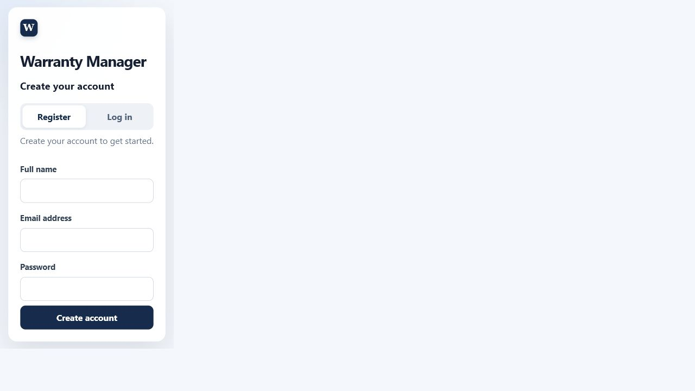
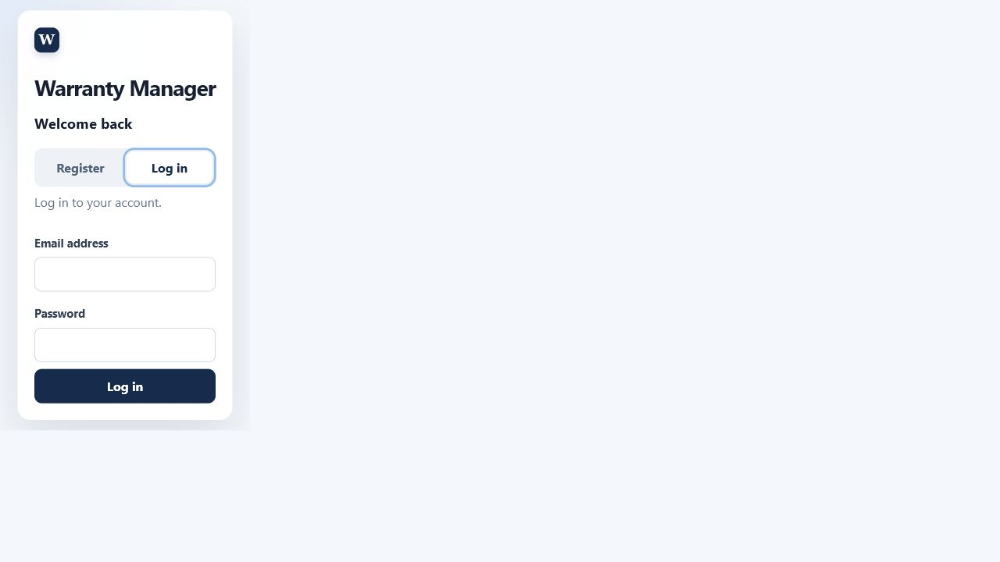
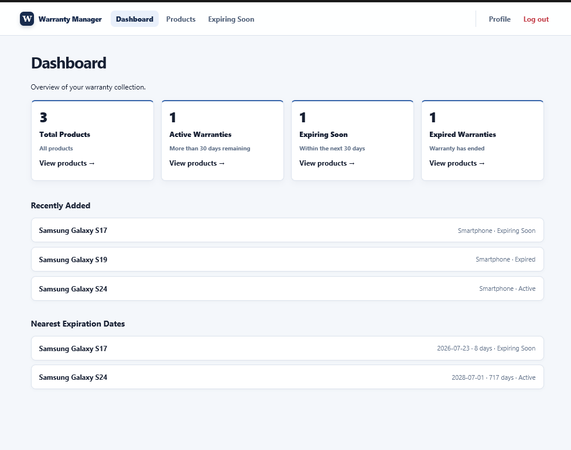
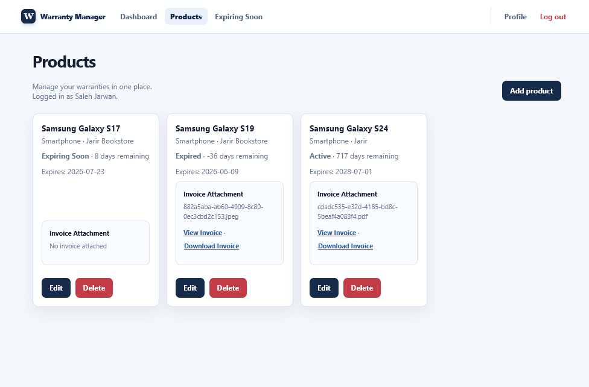
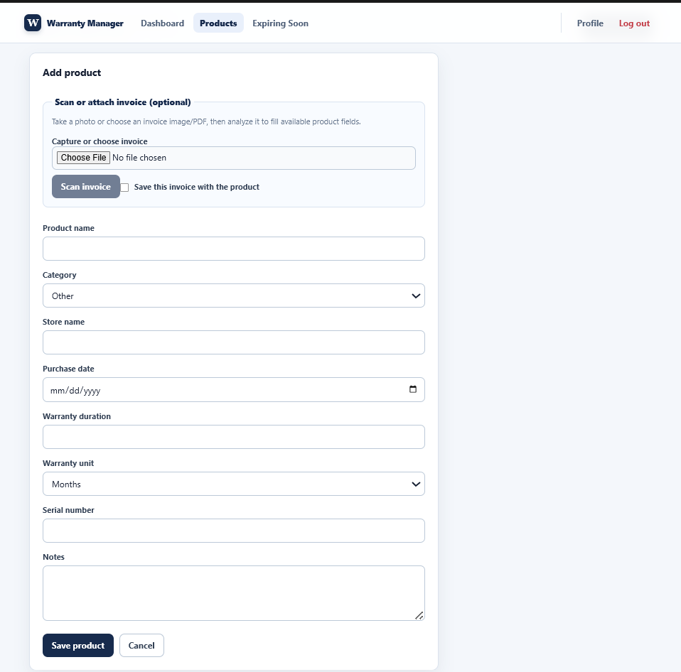
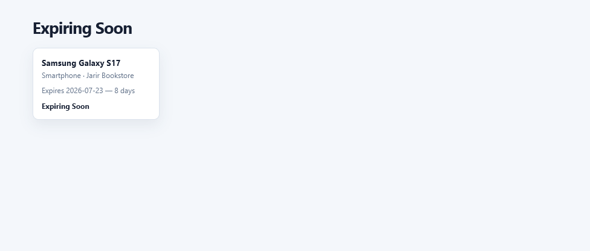
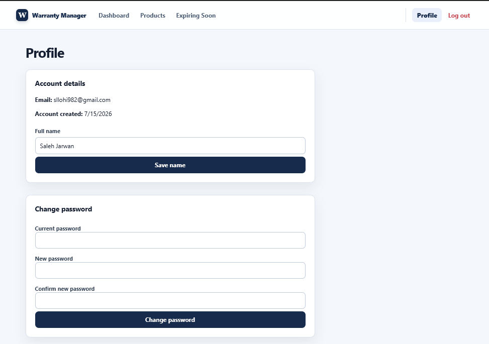

# Warranty Manager

**Developed by:**  Saleh Khalid Jarwan

----

## Project Overview

Warranty Manager is a responsive web application for keeping product warranty information and purchase invoices in one place. It is intended for individuals, families, students, professionals, and small businesses that need to avoid lost invoices and missed warranty expiry dates. Users can create an account, manage their own products, attach invoices, and see warranty status and days remaining.

## Main Features

- Account registration, login, logout, and session-based private routes.
- Product creation, listing, editing, and deletion for the signed-in owner.
- Warranty expiration-date calculation, remaining-day calculation, and **Active**, **Expiring Soon**, and **Expired** statuses.
- Dashboard totals, recently added products, and nearest expiration dates.
- A dedicated Expiring Soon page.
- Optional invoice attachment, owner-only invoice viewing, and download.
- Invoice image/PDF analysis with OCR and detected-field filling.
- Profile name editing and password change.
- Controlled product categories, client- and server-side input validation, and responsive styling.

The API has a product-by-ID endpoint, but the current frontend does not expose a dedicated Product Details page. Search, category filtering, and sorting are also not implemented as standalone controls.

## Application Screenshots

The following are real application screenshots. The dashboard and product screens show three Samsung Galaxy products: one Active, one Expiring Soon, and one Expired. The profile capture shows the signed-in user’s account settings.

### Registration



### Login



### Dashboard

Dashboard statistics, recently added products, and nearest warranty expiration dates.



### Products

Product cards show warranty status, remaining days, expiration date, invoice actions, and Edit/Delete controls.



### Add Product and invoice scanning controls

The add-product form shows the optional invoice capture, scan, and save controls alongside product fields.



### Invoice attachment actions

Users can capture or choose an invoice, run invoice scanning, and choose whether to save the attachment with the product.


### Expiring Soon

The Expiring Soon page highlights products that have 30 days or fewer remaining.



### Profile

The profile page displays account details and provides name and password update forms.



There is no Product Details UI to capture in the current frontend. A terminal screenshot of Jest output was not added, because an actual terminal-image capture was not available and no fabricated image was used; the exact passing results appear in [Automated Tests](#automated-tests).

## Technology Stack

### Frontend

- React, JavaScript, HTML, and CSS
- Vite
- Fetch API

### Backend and database

- Node.js and Express
- MySQL with `mysql2`

### Authentication and security

- `express-session`
- `bcrypt`
- Helmet
- `express-rate-limit`
- CORS and request-origin validation for unsafe methods

### File handling

- Multer
- `tesseract.js` for image OCR
- `pdf-parse` for PDF text extraction
- `heic-convert` for HEIC/HEIF conversion before OCR

### Testing

- Jest
- Supertest
- React Testing Library

## Project Structure

```text
.
├── .agents/                 # Agent workspace metadata
├── backend/                 # Express API, middleware, services, and backend tests
├── database/                # MySQL configuration bridge and schema
├── docs/screenshots/        # Captured application screenshots
├── frontend/                # React/Vite application and frontend tests
├── AGENTS.md                # Mandatory development, TDD, and security rules
├── PRD.md                   # Product requirements
├── REVIEWER.md              # Independent review instructions
├── SECURITY_REVIEW.md       # Final security review and remediation record
├── .env.example             # Safe environment-variable template
└── .gitignore               # Ignored local/generated files
```

## Product Requirements

[PRD.md](PRD.md) defines the product overview, features, UX flow, and technical and security constraints.

## AGENTS.md Rules

[AGENTS.md](AGENTS.md) requires small, focused changes; TDD; validation; parameterized MySQL queries; bcrypt password hashing; protected private routes; ownership checks; safe uploads; secure sessions; rate limits; Helmet; and `.env`-based secrets.

Examples implemented in this codebase include:

- Registration and password changes use `bcrypt.hash(..., 12)`; login uses `bcrypt.compare`.
- Database operations use `database.execute` with `?` placeholders, including product queries that scope by both product ID and `req.session.user.id`.
- `requireAuthentication` protects products, invoice analysis, dashboard, and profile routes.
- Invoice view and download look up `id` **and** the authenticated user ID, returning a safe 404 for missing or unowned records.
- Multer applies an extension/MIME allowlist and a 10 MB size limit; attachments use UUID filenames and containment checks.
- Database settings and the session secret are read from environment variables. The server refuses to start without `SESSION_SECRET`.

## Test-Driven Development

The required workflow is `RED → GREEN → REFACTOR`:

1. Write the relevant test.
2. Run it and confirm it fails.
3. Add the minimum implementation.
4. Run until the test passes.
5. Refactor as needed.
6. Run the related tests again.

### TDD Evidence Example

**Feature:** Protected profile API and password change  
**Test file:** `backend/tests/profile.test.js`

**RED:** The test was created before the Profile router existed. `GET /api/profile` returned `404` instead of the expected authenticated JSON response.

**GREEN:** Added `backend/src/routes/profile.js`, mounted it at `/api/profile`, required the session middleware, and added validated name and bcrypt-backed password update handlers.

**REFACTOR:** The route uses a small shared `validName` helper and returns only public profile fields.

**Final result:** `npm.cmd test -- --runInBand profile.test.js` passed: 1 suite, 2 tests.

### TDD Evidence Example

**Feature:** Compact invoice display  
**Test file:** `frontend/src/ProductsPage.test.jsx`

**RED:** The new test expected an image invoice card not to render `alt="Camera invoice"`; it failed because the product card contained an inline image.

**GREEN:** Removed the inline image while preserving protected View Invoice and Download Invoice actions.

**REFACTOR:** Standardized the view label to `View Invoice` for both PDFs and images.

**Final result:** `npm.cmd test -- --runInBand ProductsPage.test.jsx` passed: 1 suite, 5 tests.

## Automated Tests

Run from the corresponding folders:

```powershell
cd backend
npm.cmd test

cd ..\frontend
npm.cmd test
```

Production-readiness run on July 18, 2026:

| Suite | Result |
| --- | --- |
| Backend | 29 test suites passed; 140 tests passed; 0 failed |
| Frontend | 12 test suites passed; 58 tests passed; 0 failed |

Backend tests exercise health, registration, login/session handling, authorization, product CRUD, warranty calculation/status boundaries, invoices, profile access/password updates, and CSRF origin rejection. Frontend tests exercise authentication forms, product-form validation, dashboard error handling, and invoice view/download UI behavior.

## Security Review

The review recorded in [SECURITY_REVIEW.md](SECURITY_REVIEW.md) covers the application source, database configuration/migrations, deployment settings, and automated tests. Production procedures and deployed-environment checks are in [DEPLOYMENT.md](DEPLOYMENT.md).

### Security Issue

**Severity:** High  
**Location:** `backend/src/app.js`, before route routers  
**Current use or scenario:** Session-authenticated state-changing requests previously had no request-origin validation.  
**Problem:** A malicious site could submit a cross-site request while a user had an active session.  
**Risk:** An attacker could potentially create, change, or delete a user’s application data through CSRF.  
**Fix:** `verifyRequestOrigin` now applies to `POST`, `PUT`, `PATCH`, and `DELETE`. It permits only `FRONTEND_ORIGIN` (or the local default), returns safe JSON 403 responses, and shares the origin configuration used by CORS. Session cookies are HTTP-only, `SameSite=Lax`, and secure in production.  
**Verification:** `backend/tests/security.test.js` submits registration from `https://attacker.example` and asserts a 403 response with `Request origin is not allowed.` The complete backend suite passed after the fix.  
**Result after the fix:** Untrusted unsafe cross-origin requests are rejected.  
**Status:** Fixed

## Security Controls Applied

- bcrypt password hashing, with hashes omitted from API responses.
- Parameterized MySQL statements via `database.execute`.
- Server-side validation of registration, login, products, profile names, and passwords.
- React’s normal text rendering; no `innerHTML` or `dangerouslySetInnerHTML` was found in application code.
- Request-origin validation for unsafe methods, CORS configuration, and HTTP-only, `SameSite=Lax` sessions.
- Session regeneration on login and session destruction on logout.
- Authentication middleware and owner-scoped product/invoice queries.
- Extension/MIME allowlists, 10 MB limits, UUID filenames, and path-containment checks for invoices.
- Owner-only invoice view and download endpoints.
- Safe JSON error responses without exposed database errors or stack traces.
- Login and registration rate limiting, plus Helmet headers.
- Environment-variable configuration and `.env`/`uploads/` ignore entries.

## Environment Variables

Copy the template and set local values:

```powershell
Copy-Item .env.example .env
```

```env
PORT=3000
FRONTEND_ORIGIN=http://localhost:5173
SESSION_SECRET=
DB_HOST=localhost
DB_PORT=3306
DB_USER=
DB_PASSWORD=
DB_NAME=warranty_managers
NODE_ENV=development
```

The real `.env` is local-only and must contain no values in this README. `.env` is ignored and was confirmed untracked during production-readiness review. See [DEPLOYMENT.md](DEPLOYMENT.md) for the complete production variable contract.

## Installation and Setup

1. Clone or copy the project files.
2. Install dependencies:

```powershell
cd backend
npm.cmd ci

cd ..\frontend
npm.cmd ci
```

3. Create `.env` from `.env.example` and configure MySQL and a strong `SESSION_SECRET`.
4. Create the database and schema as described below.
5. Start the backend and frontend in separate terminals.

## Database Setup

The baseline schema is [database/schema.sql](database/schema.sql). Use it only for a new isolated database. For an existing database, first take and verify a backup, then run the additive migration from `backend/`:

```powershell
npm.cmd run db:validate
npm.cmd run db:preview
npm.cmd run db:migrate
```

Database deployment commands require an explicit `DEPLOYMENT_ENV`. Mutating staging commands additionally require `STAGING_DATABASE_CONFIRMED=true`; production commands require a separate operation-specific approval value. The migration runner records applied migrations and never drops tables or columns. Follow the staging, backup, and rollback order in [DEPLOYMENT.md](DEPLOYMENT.md).

Import the schema with a locally configured MySQL client, for example:

```powershell
mysql -u <your-user> -p <database-name> < database\schema.sql
```

Do not put real credentials in this command history, source files, or README.

## Running the Application

Backend (from `backend/`):

```powershell
npm.cmd start
```

Frontend (from `frontend/`):

```powershell
npm.cmd run dev
```

Open [http://localhost:5173](http://localhost:5173). The API listens on [http://localhost:3000](http://localhost:3000), and the Vite development server proxies `/api` to it.

The backend health endpoint and frontend page were started successfully during final verification. A safe demo registration also completed, confirming local MySQL-backed registration connectivity. The isolated staging workflow and its current status are recorded in [docs/STAGING_VERIFICATION.md](docs/STAGING_VERIFICATION.md).

## Running the Tests

Use the commands in [Automated Tests](#automated-tests) during a presentation. They prove real API and UI behavior rather than empty test files, including authorization and CSRF rejection as well as core warranty and product operations.

## Required Final Checklist

- [x] `AGENTS.md` exists in the repository.
- [x] Security rules are explained.
- [x] Security rules are applied in the actual code.
- [x] TDD workflow is documented.
- [x] Automated tests cover real functionality.
- [x] All automated tests pass in the final run.
- [x] No hardcoded credentials, API keys, tokens, or session secrets were found in the reviewed application code.
- [ ] The real `.env` is confirmed untracked by Git (the `.git` reparse point is not a usable Git worktree in this environment).
- [x] `.env.example` is available.
- [x] A real CSRF issue and its fix are documented.
- [x] `PRD.md` is available.
- [x] Application screenshots are included.
- [x] A GitHub repository remote is configured; no live deployment was verified.

## Known Limitations

- OCR results depend on invoice clarity and recognizable labelled fields.
- The current frontend has no dedicated Product Details screen.
- Search, category filtering, and sorting controls described in the PRD are not present in the current frontend.
- Production invoice storage requires the persistent private mount documented in `DEPLOYMENT.md`.
- The app is a responsive web application, not a native mobile application.

## Future Improvements

- Email or push warranty reminders.
- Cloud invoice storage.
- Store integrations.
- More robust OCR extraction.
- Arabic and English language support.

## GitHub 

- GitHub repository: `https://github.com/CsSaleh17/Warranty-Manager.git`
- Live deployment: Not provided.

## Final Verification

- Frontend started successfully and returned HTTP 200.
- Backend health check returned `ok`.
- A safe local registration completed against the configured database.
- Backend and frontend test suites passed as documented above.
- Screenshot files listed in this README were captured and exist under `docs/screenshots/`.
- README links use repository-relative paths where appropriate.
- `.env` is ignored by `.gitignore` and is not tracked.
- The security review contains a real CSRF issue and verified fix.
- README feature claims were matched against current source code and tests.

## Missing Information to Add Manually

- A GitHub repository URL, if one is created.
- A live deployment URL, if one is created.
- A real terminal screenshot of the passing test output, if a terminal-capture surface is available.
